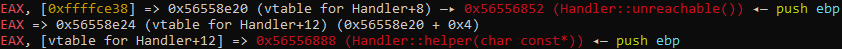
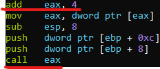
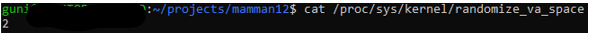
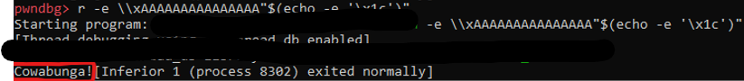
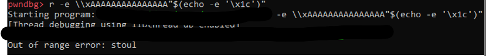

**Virtual Table Pointer Corruption – Guni Deyo Haness** 

Threat:

Information disclosure due to arbitrary code execution.

Affected component:

Echo utility program that holds a very secret password.

Module details:

Code provided in dangerous.cpp, vulnerability at handle\_escape function (lines 70-95).

Vulnerability class:

Virtual table corruption due to buffer overflow.

Description:

The Handler class contains virtual functions, therefore the compiler generates a virtual table that holds pointers to these functions, while each instance of the class holds a pointer to this table (vptr). At the handle\_escape function, a struct is being created and it holds a buffer at size of 16 which is located at the stack, and an instance “h” of the Handler class which is also located at the stack. This instance holds a vptr to the virtual table. As I found in my research, using GDB and PWNDBG, the stack memory is built such that the vptr of “h” is located straight after the memory allocated for the buffer. I found that by giving as an input a string, bigger than the 16 characters that were allocated for the buffer, and so causing buffer overflow, and then seeing on GDB that the value of vptr is being overwritten by the characters in my input string which are after the first 16.

Result:

An attacker can engineer an input string that will cause buffer overflow and overwrite vptr and so run arbitrary code by directing different functions to be executed (“unreachable” function in this case), that’s because vptr points to the virtual table that holds pointers to the virtual functions. And the “unreachable” function that the attacker wants to run, is also located in it because its virtual. 

 

Above while debugging the “interpret” function, as you can see, the difference between the addresses in vtable of the two virtual functions – “unreachable” (the code we want to run) and “helper” is 4 (0x56558e20 for “unreachable” and 0x56558e24 for “helper”). Just to make it clear, I’m talking about the difference between the addresses of the functions in the virtual table (0x56558e20 that holds the real address of “unreachable” – 0x56556852 and 0x56558e24 that holds the real address of “helper” – 0x56556888). As you can see the difference between the real addresses is different than 4 but it’s irrelevant. And as it’s shown in Assembly, the “helper” function is called because “call” gets eax, that holds the real address of “helper”. First, eax address of “unreachable” in the virtual table – 0x56558e20, then, after executing “add eax, 4”, it held the address of “helper” in the virtual table – 0x56558e24, and at last after the last change to eax: “move eax, dword ptr [eax]”, it will hold the real address of “helper” – 0x56556888 and then calls it: “call eax”.**

 

Therefore, considering the fact “helper” is being run, and that the difference between the addresses of “helper” and “unreachable” in the virtual table is 4 (“helper” is 4 ahead), if we overwrite vptr by vptr – 4, we will successfully get “unreachable” function to be run. At the previous screenshot we could see vptr holds the address 0x56558e20, therefore we want to lower its value by 4 and overwrite it with the address 0x56558e1c. Due to Little Endian format, the address 0x56558e20 is saved as \x20\x8e\x55\x56 in memory, and so we need to overwrite only the first byte, \x20 to be \x1c instead. Because we overwrite only this part of the address, which is a part of the offset, this attack will work in most machines even with ASLR turned on, because ASLR changes only the page number but the offset stays consistent. Finally, we can engineer the input exploit string; of course, it has to start with \\x so we’ll call handle\_escape function where the struct with the buffer and Handler instance “h” are created, and we will start filling the buffer (first the buffer will be filled by ‘x’). So, in order to start the buffer overflow and to overwrite that one byte, we have 15 more “trash” characters to put in the buffer. I chose ‘A’ to be the “trash” character. At last, we will just add \x1c to overwrite and replace \x20, and we are done! I used echo command to put \x1c as this character cannot be seen. Of course, we have to add “-e” to enable interpretation of “\\”. And the input string is:         **\\xAAAAAAAAAAAAAAA\x1c**                                                And the arguments to the function in ubuntu format will be:       **-e \\xAAAAAAAAAAAAAAA”$(echo -e ‘\x1c’)”**                and as you can see the secret password is printed!                  (As I explained, this attack should work with ASLR turned on as well, and indeed, for me it does):           

 

 

Prerequisites:

This threat/attack was successful due to the ability to debug, in most scenarios the user of this software won’t be able to debug the program, only running it – making the attack less likely to occur. Information disclosure - the very secret password has been leaked!

Business impact:

If this software is owned by a company, this password might permit the attacker to access the company’s data bases, and so use private data of users and make the company face serious complaints due to federal user privacy rules. 

Proposed remediation:

Prevent buffer overflow by using a counter and taking only the first 15 characters from the input string and leaving a place for the null terminator. (Implemented in the fixed code file separately). Also, I noticed some input strings such as \\x with more than 8 characters after, cause out of range exception from ‘stoul’ in the “helper” function, so I added ‘try and catch’ declarations to “helper" in order to prevent the program from crashing. Using the exploit input string that we engineered with the fixed code will just cause an exception and so the attack will fail:

 

Risk:

Damage potential: 9 – very secret information disclosure.

Reproducibility: 6 – due to the fact, as I explained, this attack should work and does work for me with ASLR turned on, the attack is easier to reproduce.

Exploitability: 3 – this attack was successful due to the ability to debug, which probably won’t be available to a regular user of the software.

Affected users: 8 – potentially, the secret password disclosure could lead to users` private information leakage, in case this software is owned by a company that holds data bases of user and their private info. 

Discoverability: 8 – today many tools/compilers can help find buffer overflow vulnerabilities.

